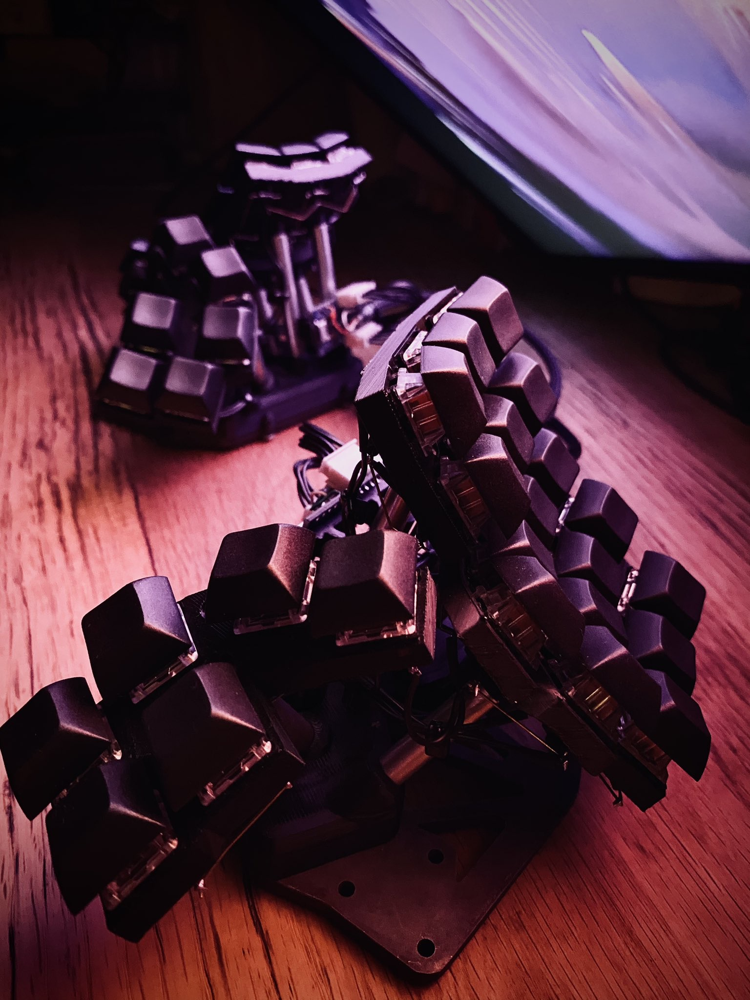

# Dactyl Manuform Skeleton Edition 4x5

[Dactyl-Manuform](https://github.com/tshort/dactyl-keyboard) のリミックスモデルです。

## 系統樹

## ストーリー

[エルゴノミックな自作キーボード Dactyl Manuform のカスタムモデルを作る話—コンセプト&基本設計編—](https://www.creativity-ape.com/entry/2021/03/13/080000)

## ビルドガイド

[エルゴノミックでサイバーパンクな自作キーボード"Dactyl Manuform Skeleton Edition 4x5 "を作った話—ビルドガイド—](https://www.creativity-ape.com/entry/2021/06/18/121519)

## 3Dプリント用データ

- /things
  - baseplate
  - bottom
  - top
  - index
  - thumb
  - pro micro bracket

## プロジェクトの進捗

- 最新の進捗状況は[Twitter @aaa_tu](https://twitter.com/aaa_tu/status/1351311085035429888?s=20)

